# 对比模型、优化器、调度器

## FCNN AdamW CosineAnnealingLR

Test Acc: 61.03%

Epoch=87 时同时取得 Val Acc 和 Val Loss 最值

~~~bash
# 命令
python main.py --train --test
~~~

~~~bash
Epoch: 87
Train Loss: 0.7835, Train Acc: 71.42%
Val   Loss: 1.2099, Val   Acc: 60.14%
~~~

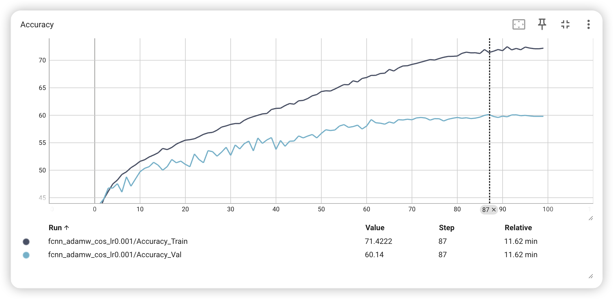
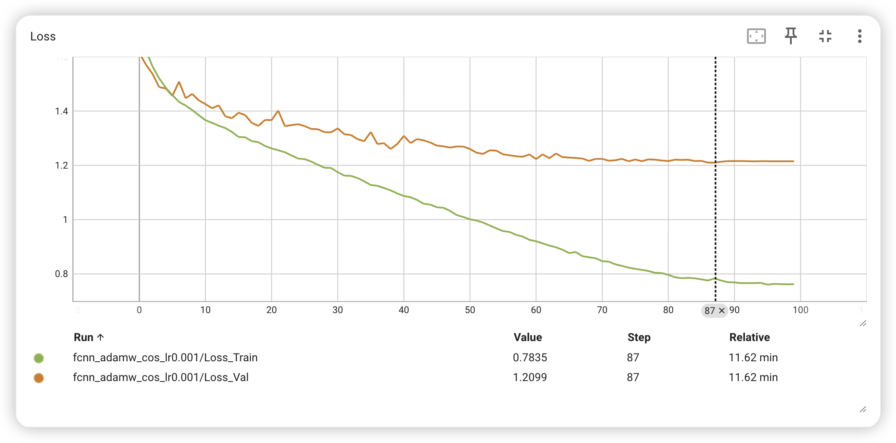

## CNN AdamW CosineAnnealingLR

Test Acc: 83.50%

Epoch=93 时同时取得 Val Acc 和 Val Loss 最值

~~~bash
# 命令
python main.py --train --test -m cnn
~~~

~~~bash
Epoch: 93
Train Loss: 0.2921, Train Acc: 90.52%
Val   Loss: 0.5043, Val   Acc: 83.64%
~~~

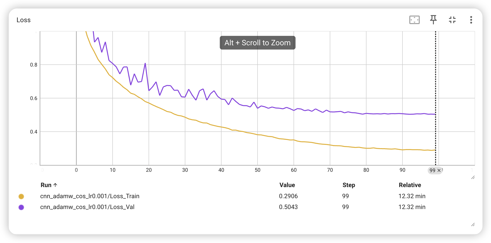

## LinearClassifier AdamW CosineAnnealingLR

Test Acc: 42.08%

Epoch=92 时取得 Val Acc 最大值

Epoch=98, 99 时取得 Val Loss 最小值

~~~bash
# 命令
python main.py --train --test -m linear
~~~

~~~bash
Epoch: 92
Train Loss: 1.6968, Train Acc: 41.90%
Val   Loss: 1.7286, Val   Acc: 41.46%

Epoch: 98
Train Loss: 1.6915, Train Acc: 42.21%
Val   Loss: 1.7276, Val   Acc: 41.24%

Epoch: 99
Train Loss: 1.6919, Train Acc: 42.41%
Val   Loss: 1.7276, Val   Acc: 41.30%
~~~

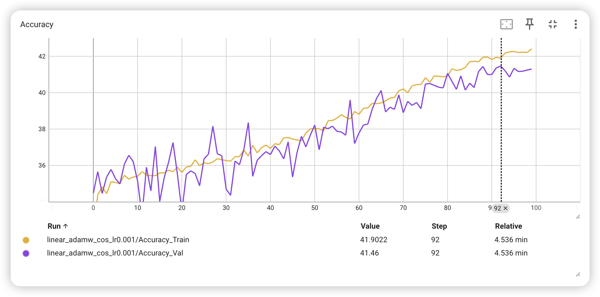
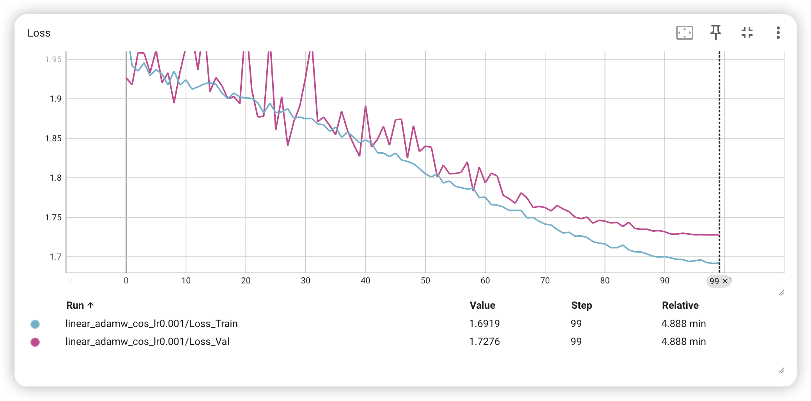

## FCNN SGD CosineAnnealingLR

Test Acc: 60.60%

Epoch=90 时取得 Val Acc 最大值

Epoch=94, 97, 98, 99 时取得 Val Loss 最小值

~~~bash
# 命令
python main.py --train --test -o sgd
~~~

~~~bash
Epoch: 90
Train Loss: 1.0539, Train Acc: 62.72%
Val   Loss: 1.1481, Val   Acc: 60.14%

Epoch: 94
Train Loss: 1.0559, Train Acc: 62.62%
Val   Loss: 1.1474, Val   Acc: 59.98%

Epoch: 97
Train Loss: 1.0501, Train Acc: 62.98%
Val   Loss: 1.1474, Val   Acc: 60.04%

Epoch: 98
Train Loss: 1.0533, Train Acc: 62.79%
Val   Loss: 1.1474, Val   Acc: 60.04%

Epoch: 99
Train Loss: 1.0517, Train Acc: 62.75%
Val   Loss: 1.1474, Val   Acc: 60.06%
~~~

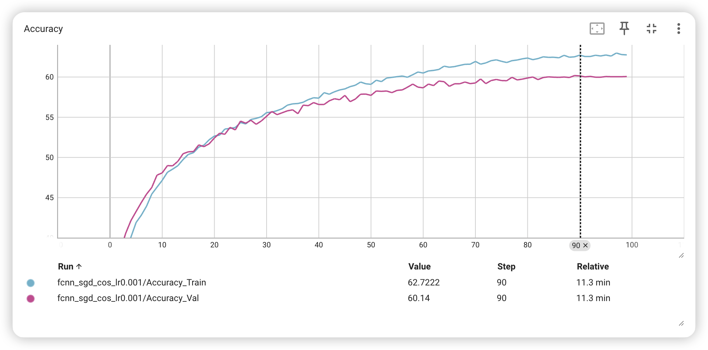
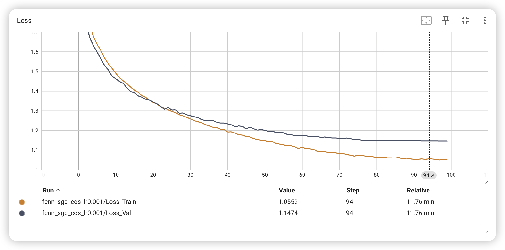

## FCNN AdamW StepLR

**stride=5**

Test Acc: 57.71%

**stride=10**

Test Acc: 58.98%

Epoch=61 时取得 Val Acc 最大值

Epoch=58 时取得 Val Loss 最小值

~~~bash
# 命令
python main.py --train --test -s step
~~~

~~~bash
Epoch: 58
Train Loss: 0.9156, Train Acc: 66.54%
Val   Loss: 1.2062, Val   Acc: 57.28%

Epoch: 61
Train Loss: 0.9053, Train Acc: 66.73%
Val   Loss: 1.2112, Val   Acc: 57.76%
~~~

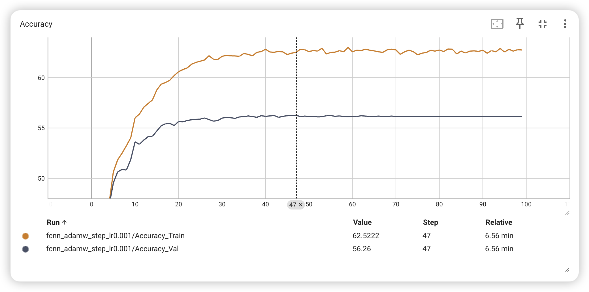
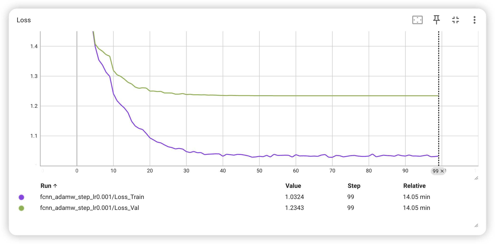

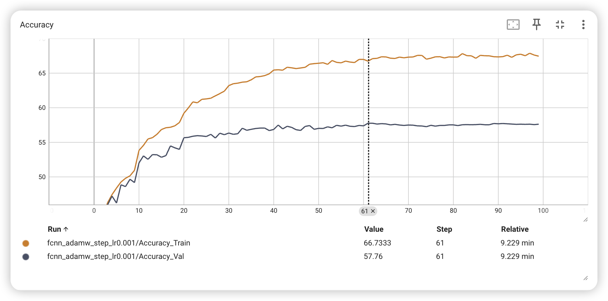
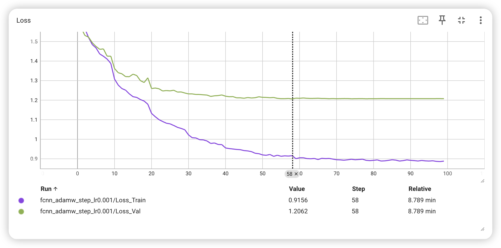
