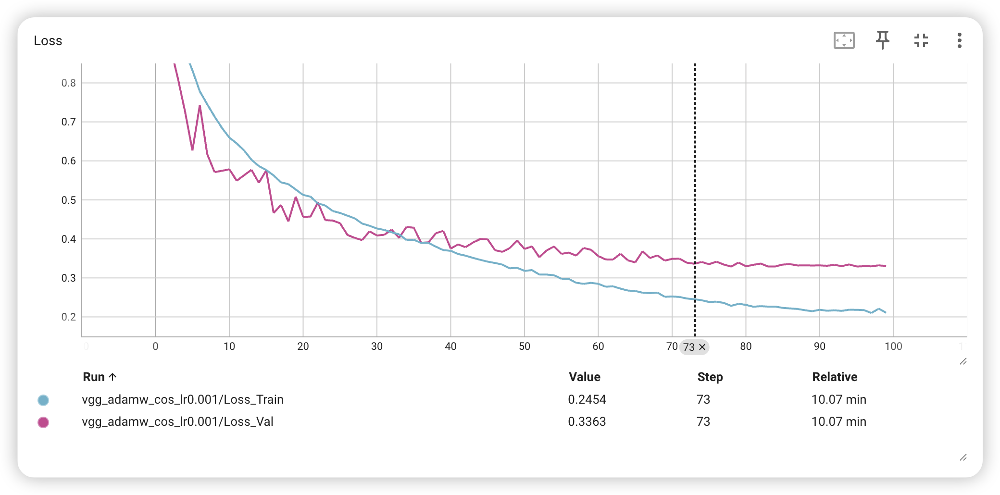
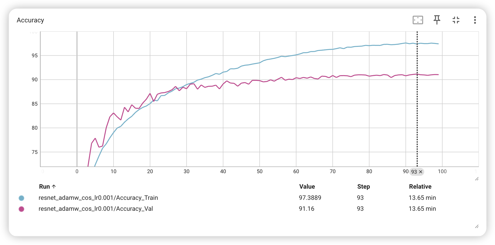
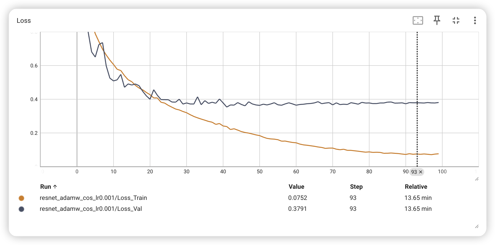
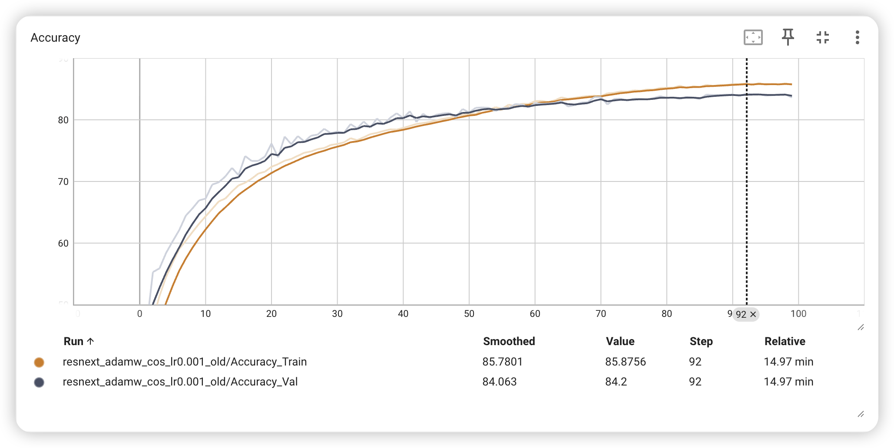
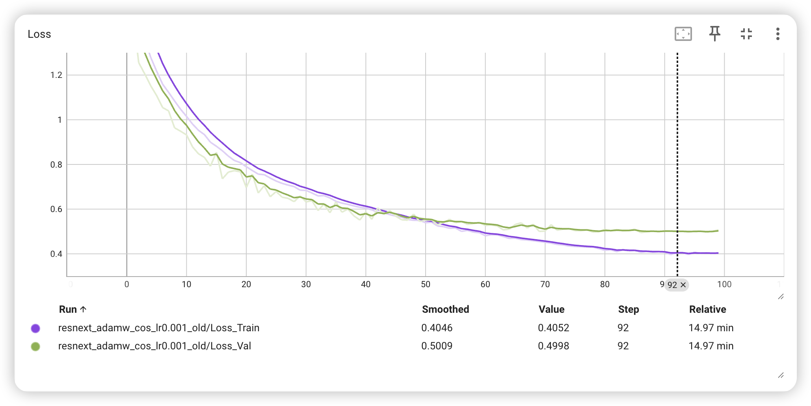
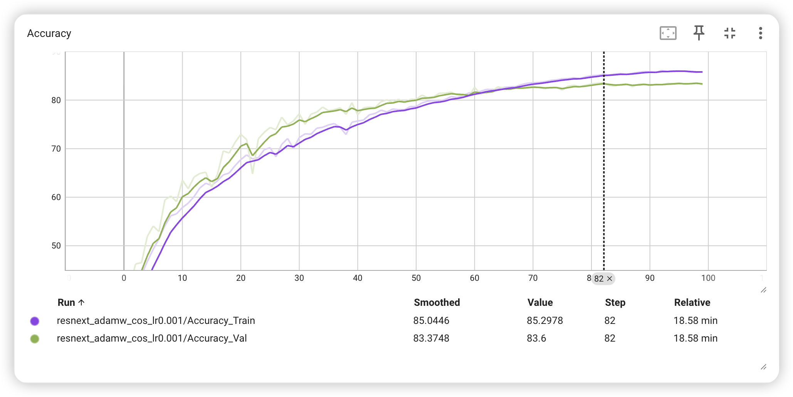
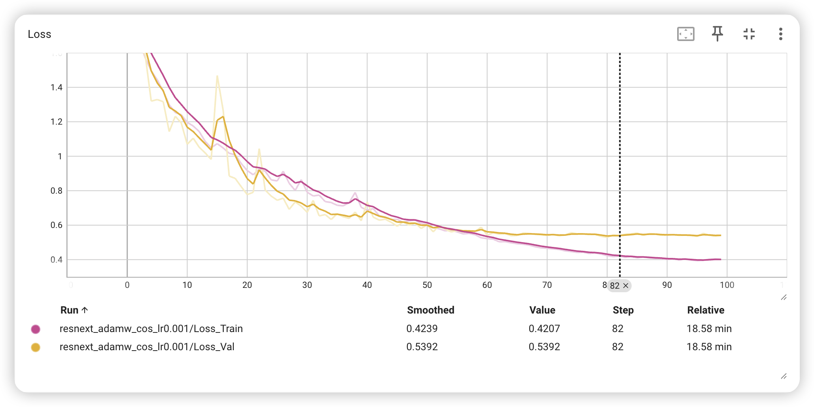
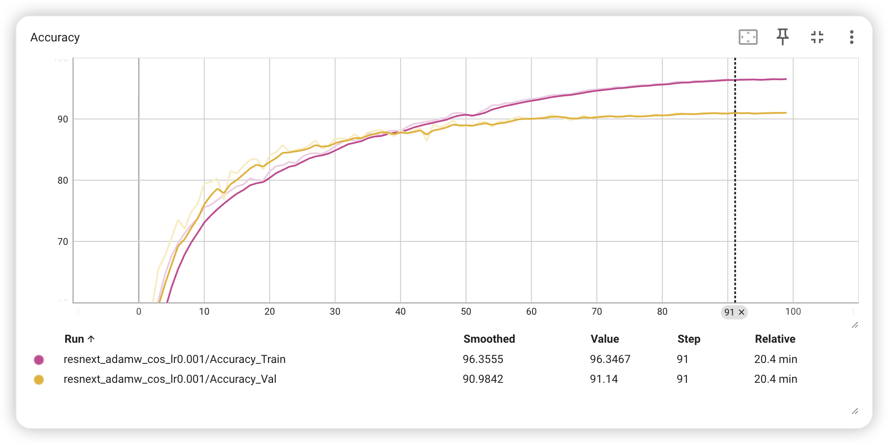
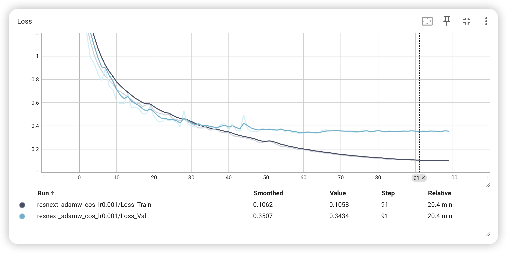

# 1. VGG

Test Loss: 0.3576, Test Acc: 88.88%

# 2. ResNet

Test Loss: 0.3686, Test Acc: 90.55%

# 3. ResNext: [2, 2, 2, 2], bottle_neck=4, group=8, fc_in_channel=512

Test Loss: 0.5041, Test Acc: 83.85%

# 4. ResNext: [2, 2, 3, 3, 3], bottle_neck=4, group=8, fc_in_channel=512

Test Loss: 0.5473, Test Acc: 82.20%

# 5. ResNext: [3, 3, 3, 3], bottle_neck=4, group=4, fc_in_channel=2048

Test  Loss: 0.3559, Test  Acc: 90.68%

